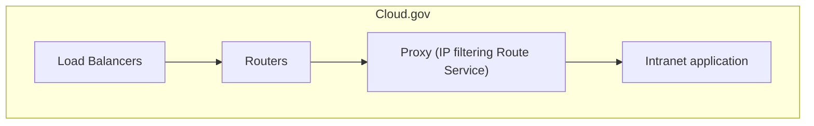

# README

This project demonstrates hosting a private intranet application on cloud.gov using Cloud Foundry's Route Service feature.



## Requirements

Install and log into the [Cloud Foundry CLI](https://docs.cloudfoundry.org/cf-cli/install-go-cli.html).

## Usage

Create a space for the project and enable public networks egress:

```sh
cf target -o your-org
cf create-space your-space

# WARNING: This allows outbound traffic from your space to the public internet.
# In cloud.gov, this is disabled by default.
cf bind-security-group public_networks_egress your-org --space your-space
```

Deploy the project to your space using the `deploy.sh` script:

```sh
ALLOWED_IPS="comma_separated_list_of_ips_eg_1.2.3.4,5.6.7.8" \
ROUTE_SERVICE_APP_NAME="name_of_the_app_to_push" \
ROUTE_SERVICE_NAME="name_of_the_route_service_to_create" \
PROTECTED_APP_NAME="name_of_the_app_to_protect" \
./deploy.sh
```

For example:

```sh
ALLOWED_IPS="1.2.3.4,5.6.7.8/32" \
ROUTE_SERVICE_APP_NAME="intranet-proxy" \
ROUTE_SERVICE_NAME="intranet-proxy" \
PROTECTED_APP_NAME="intranet-app" \
./deploy.sh
```

### Checking that it works

The route service exposes two paths for checking the status.

The path `/_route-service-health` is for information and health checking, and has stats about the number of active connections which exist.

The path `/_route-service-check` is for checking if you may use the route service. If you are, then you will receive `OK`, if you are not you will received `Forbidden by ((app-name))`, where `((app-name))` is the value of the `APP_NAME` environment variable.

## Components

### Proxy

The `intranet-proxy` application is a reverse proxy with IP address filtering, built using the nginx buildpack. It is based on the [alphagov/paas-ip-authentication-route-service](https://github.com/alphagov/paas-ip-authentication-route-service) project, with some modifications to work well on cloud.gov. See comments in `proxy/nginx.conf` for details.

### App

The `intranet-app` application is a simple Go web server based on the `go-hello` application from [cloud-gov/cf-hello-worlds](https://github.com/cloud-gov/cf-hello-worlds). Other applications will work similarly, as long as they answer HTTP requests on the default port.

## Notes

- nginx is not a requirement; any reverse proxy could be used as a route service. An nginx buildpack is built in to cloud.gov, but other proxies are supported using the apt buildpack, binary buildpack, a Docker image, or building from source.

## Further reading

- [Cloud Foundry: Route Services](https://docs.cloudfoundry.org/services/route-services.html)
- [Cloud.gov: Controlling Egress Traffic](https://cloud.gov/docs/management/space-egress/)
